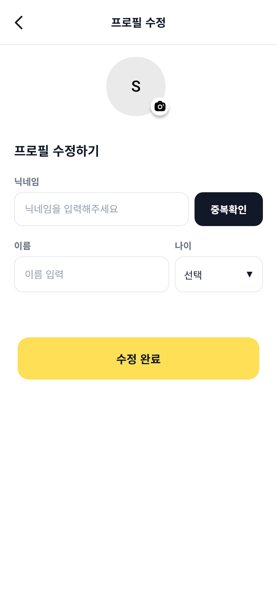
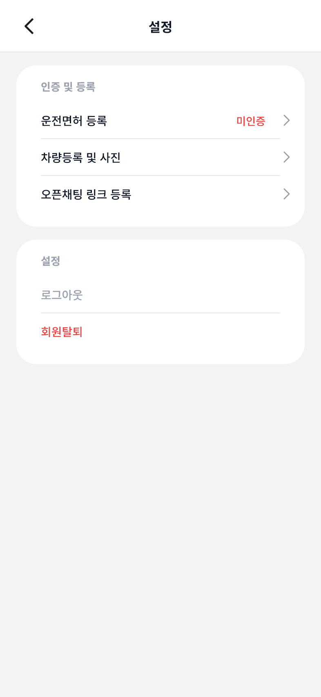
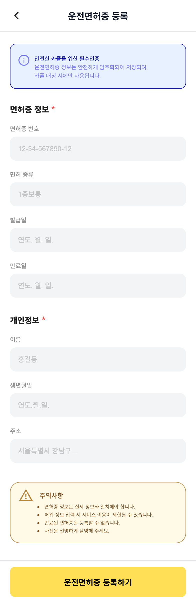
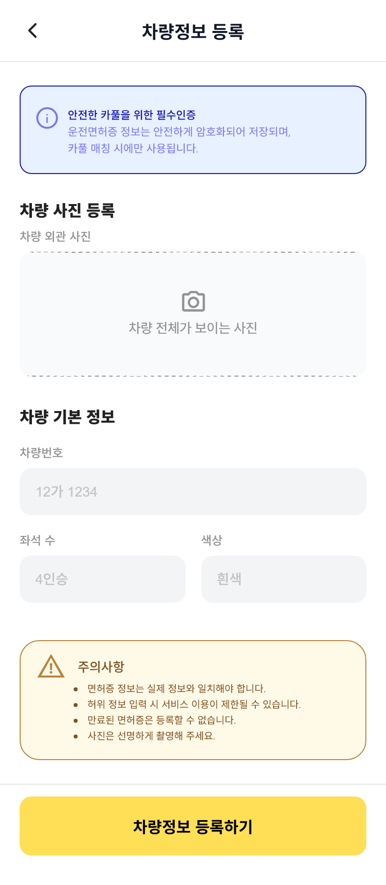

# 🚗 붕붕 (BoongBoong) Frontend

> 대학 구성원이 함께 이동할 동행자를 찾고 카풀을 이용할 수 있도록 만든  
> **대학생 대상 카풀 커뮤니티 웹 서비스**입니다.

멋쟁이사자처럼 한서대학교 활동 중 진행한 팀 프로젝트입니다.

학교 이메일 기반 사용자 인증과 카풀 모집·검색·매칭,  
운전면허·차량정보와 사용자 신뢰 정보를 활용하여  
대학생 사이의 안전한 동행 경험을 제공하는 것을 목표로 개발했습니다.

---

## Project Overview

- **Project:** 붕붕 (BoongBoong)
- **Period:** 2025.09 ~ 2025.12
- **Type:** 멋쟁이사자처럼 한서대학교 팀 프로젝트
- **My Role:** Frontend UI Implementation
- **Main Stack:** `React` `JavaScript` `CSS`

> 이 프로젝트에서 저는 **프론트엔드 화면 디자인 구현을 담당했습니다.**
>
> API 연동, Backend 개발 및 서비스 배포는 제 담당 범위에 포함되지 않습니다.  
> 현재 `main` 브랜치에는 이후 팀 통합 과정에서 추가된 API 연동 코드가 일부 포함되어 있으며,  
> 아래 `My Contribution`은 실제 담당했던 UI 구현 범위를 기준으로 작성했습니다.

---

## Screenshots

제가 담당하여 구현한 주요 Frontend UI입니다.

<table>
  <tr>
    <td align="center" width="50%">
      
       
      <b>프로필 수정</b>
    </td>
    <td align="center" width="50%">
      
       
      <b>설정</b>
    </td>
  </tr>
  <tr>
    <td align="center" width="50%">
      
       
      <b>운전면허 등록</b>
    </td>
    <td align="center" width="50%">
      
       
      <b>차량정보 등록</b>
    </td>
  </tr>
</table>

---

## Service

붕붕은 대학생이 운전자 또는 탑승자로 카풀 게시글을 등록하고,  
조건에 맞는 동행을 찾아 매칭할 수 있도록 구성한 서비스입니다.

팀 프로젝트 전체 기준 주요 기능은 다음과 같습니다.

- 학교 이메일 기반 회원가입 및 인증
- 운전자 / 탑승자 카풀 게시글 등록 및 검색
- 카풀 게시글 상세 조회 및 동행 신청
- 매칭 요청 승인·거절 및 카풀 이용 내역 관리
- 사용자 프로필 및 신뢰점수 관리
- 운전면허·차량정보 등록
- 카풀 완료 후 리뷰 작성

---

## My Contribution

프로젝트에서 **모바일 환경을 기준으로 한 화면 UI 구현**을 담당했습니다.

하나의 페이지에 모든 UI를 작성하기보다  
`Page`, `Header`, `Form Section`, `Action Section` 등 역할에 따라 컴포넌트를 나누어 구현했습니다.

### 1. 프로필 수정

사용자가 자신의 프로필 정보를 확인하고 수정할 수 있는 화면을 구현했습니다.

**구현 UI**

- 프로필 수정 전체 레이아웃
- 상단 헤더 및 뒤로가기
- 프로필 이미지 영역
- 닉네임 입력 및 중복확인 버튼
- 이름 / 나이 입력 영역
- 나이 선택 Dropdown
- 하단 수정 완료 버튼

**Main Components**

- `ProfileEditPage`
- `ProfileEditHeader`
- `ProfileEditForm`
- `ProfileEditSaveBar`

**Location:** `src/Useredit/`

---

### 2. 매너벌 / 사용자 등급

사용자의 서비스 신뢰도를 시각적으로 확인할 수 있는  
**매너벌 등급 화면 UI**를 담당했습니다.

**구현 UI**

- 매너벌 전체 페이지
- 상단 헤더
- 현재 사용자 등급 표시 영역

**담당 Components**

- `BeeGradePage`
- `BeeGradeHeader`
- `BeeCurrentGradeSection`

> 해당 화면은 당시 프로젝트에서 담당했던 UI입니다.  
> 현재 공개 저장소의 `main` 브랜치에서는 프로젝트 통합 과정으로 인해  
> 동일한 파일 구조가 유지되고 있지 않습니다.

---

### 3. 설정

사용자 인증 및 계정 관련 화면으로 이동할 수 있는  
설정 페이지 UI를 구현했습니다.

**구현 UI**

- 설정 전체 레이아웃
- 상단 설정 헤더
- 인증 및 등록 카드
- 운전면허 등록 항목
- 차량정보 등록 항목
- 오픈채팅 등록 항목
- 로그아웃 / 회원탈퇴 영역

**Main Components**

- `SettingsPage`
- `SettingsHeader`
- `MyVerificationSection`
- `SettingsAccountSection`

**Location:** `src/Settings/`

---

### 4. 운전면허 등록

운전자가 서비스 이용에 필요한 운전면허 정보를 입력할 수 있도록  
등록 화면 UI를 구현했습니다.

**구현 UI**

- 운전면허 등록 전체 페이지
- 상단 헤더
- 필수 인증 안내 영역
- 면허증 번호 / 면허 종류 입력
- 발급일 / 만료일 입력
- 이름 / 생년월일 / 주소 입력
- 주의사항 영역
- 하단 등록 버튼

**Main Components**

- `LicenseRegisterPage`
- `LicenseHeader`
- `LicenseInfoSection`
- `LicensePersonalSection`
- `LicenseSubmitSection`

**Location:** `src/Settings/Driverlicense/`

---

### 5. 차량정보 등록

카풀 운전자가 자신의 차량 정보를 입력할 수 있도록  
차량 등록 화면 UI를 구현했습니다.

**구현 UI**

- 차량정보 등록 전체 페이지
- 상단 헤더
- 차량 사진 등록 영역
- 차량번호 입력
- 좌석 수 입력
- 차량 색상 입력
- 주의사항 영역
- 하단 등록 버튼

**Main Components**

- `CarRegisterPage`
- `CarHeader`
- `CarPhotoSection`
- `CarBasicInfoSection`
- `CarSubmitSection`

**Location:** `src/Settings/Carinfo/`

---

## UI Implementation

### Component Separation

화면의 역할에 따라 UI 컴포넌트를 분리했습니다.

    Page
    ├─ Header
    ├─ Information / Form Section
    └─ Submit / Save Section

페이지 레이아웃과 입력 영역, 액션 영역의 역할을 구분하고  
각 컴포넌트별 스타일을 독립적으로 관리할 수 있도록 구성했습니다.

### Mobile-first Layout

담당 화면은 프로젝트 디자인 기준인 약 `393px` 모바일 화면을 중심으로 구현했습니다.

특히 다음 요소의 일관성을 맞추는 데 중점을 두었습니다.

- Header 영역 정렬
- 카드 형태의 정보 영역
- 입력 Form 간 간격
- CTA 버튼 크기 및 위치
- Border Radius 및 내부 여백
- 입력 / 인증 / 설정 화면 사이의 디자인 일관성

---

## Tech Stack

### My Contribution

| Category        | Technology      |
| --------------- | --------------- |
| Frontend        | React           |
| Language        | JavaScript      |
| Styling         | CSS             |
| UI Architecture | React Component |

### Current Integrated Repository

현재 통합된 Frontend 저장소에는 다음 기술이 포함되어 있습니다.

| Category              | Technology                  |
| --------------------- | --------------------------- |
| Frontend              | React 19.1.1                |
| Routing               | React Router DOM            |
| HTTP Client           | Axios                       |
| Animation             | Framer Motion               |
| UI                    | Swiper, React Mobile Picker |
| Hosting Configuration | Firebase Hosting            |

> ※ Axios 및 Firebase Hosting은 통합 저장소 기준 기술입니다.

---

## Project Structure

전체 Frontend 프로젝트는 기능 단위로 구성되어 있습니다.

    src/
    ├─ Start_Pages/          # 서비스 시작
    ├─ Sign_Pages/           # 회원가입
    ├─ Main_Pages/           # 메인
    ├─ Search_Pages/         # 카풀 검색
    ├─ Write_pages/          # 카풀 게시글 작성
    ├─ CardDetail/           # 카풀 상세
    ├─ My_Carpool/           # 내 카풀
    ├─ My_Page/              # 마이페이지
    │
    ├─ Useredit/             # 담당: 프로필 수정
    │
    ├─ Settings/             # 담당: 설정
    │  ├─ Driverlicense/     # 담당: 운전면허 등록
    │  └─ Carinfo/           # 담당: 차량정보 등록
    │
    ├─ Review/
    ├─ Kakao/
    ├─ components/
    ├─ layout/
    ├─ api/
    └─ assets/

---

## Team-wide Backend

Frontend와 함께 사용된 Backend는 별도의 **Java / Spring Boot 프로젝트**로 개발되었습니다.

회원 인증, 카풀 게시글, 검색·매칭, 마이페이지, 운전면허·차량정보,  
리뷰 및 사용자 신뢰점수 등의 기능을 Backend에서 처리합니다.

**Backend Repository:**  
[jaemin-devlog/BoongBoong](https://github.com/jaemin-devlog/BoongBoong)

---

## Getting Started

### Requirements

- Node.js
- npm

### Install

    git clone https://github.com/developer-sw/boongboong.git
    cd boongboong
    npm install

### Environment

현재 통합 코드에서 Backend API를 사용하는 경우  
프로젝트 루트에 `.env` 파일을 생성합니다.

    REACT_APP_API_URL=<BACKEND_API_URL>

### Run

    npm start

기본 개발 서버는 `http://localhost:3000`에서 실행됩니다.

### Build

    npm run build

---

## What I Learned

이 프로젝트를 통해 React 기반 팀 프로젝트에서  
모바일 화면을 여러 UI 컴포넌트로 분리하여 구현하는 경험을 했습니다.

특히 다음과 같은 Frontend 개발 경험을 쌓았습니다.

- 페이지 단위 UI 구조 설계
- 역할에 따른 React 컴포넌트 분리
- 입력 Form 중심 모바일 UI 구현
- CSS를 활용한 모바일 레이아웃 구성
- 공통 디자인 규칙을 적용한 화면 간 UI 일관성 유지
- 팀 프로젝트 내 Frontend 역할 분담 및 협업

이 프로젝트는 **Frontend 개발자로 참여했던 프로젝트**이며,  
이후 Java / Spring Boot 기반 Backend 개발을 중심으로 역량을 확장하고 있습니다.
